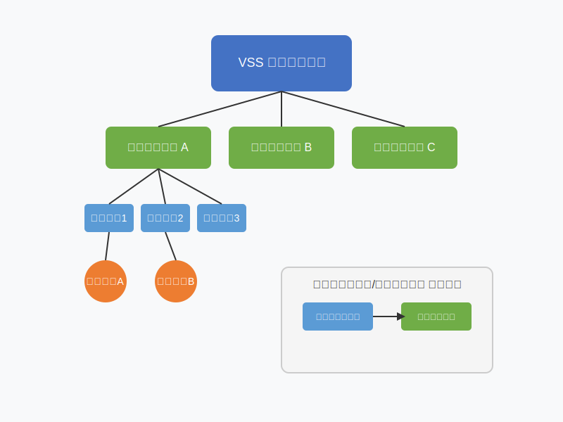
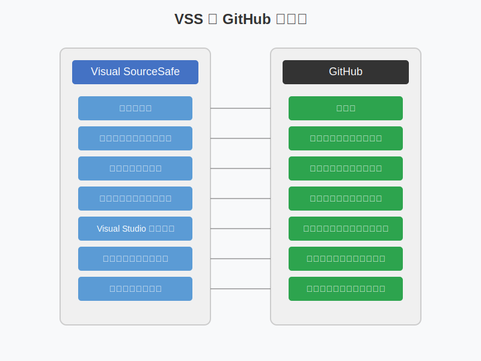

# Microsoft Visual SourceSafe 詳細ガイド

Visual SourceSafe (VSS) の使い方を一つずつ丁寧に説明します。また、GitHub との違いも含めています。

## 1. インストールと初期設定

### インストール手順

1. **Visual SourceSafe をダウンロード**：Microsoft から VSS をダウンロードします
2. **インストーラーを実行**：画面の指示に従ってインストールを完了します
3. **管理者ツールを起動**：スタートメニュー → Programs → Microsoft Visual SourceSafe → Visual SourceSafe Admin

### データベース作成

1. **新規データベースの作成**：
   - 管理者ツールで File → Open SourceSafe Database を選択
   - Create a new database をクリック
   - データベースの保存場所を選択（例：C:\VSS\data）
   - Create をクリック

### ユーザー追加

1. **管理者ツールで** User → Add User を選択
2. **ユーザー名**とパスワードを入力
3. **権限レベル**を選択（Read, Check Out, Add & Check In, Destroy, Admin）

## 2. プロジェクト作成と管理

### VSS Explorer を起動

1. スタートメニュー → Programs → Microsoft Visual SourceSafe → Visual SourceSafe
2. ユーザー名とパスワードを入力してログイン

### 新規プロジェクト作成

1. **ルートまたは親プロジェクトを選択**
2. **File → Create Project** を選択
3. **プロジェクト名**を入力（例：WebApp）
4. **OK** をクリック
   

## 3. ファイル管理の基本操作

### ファイルの追加

1. **プロジェクトを選択**
2. **File → Add Files** を選択（または右クリックメニューから Add Files）
3. 追加するファイルを選択
4. **説明（コメント）** を入力（オプション）
5. **OK** をクリックして追加完了

### ファイルのチェックアウト

1. **編集したいファイルを右クリック**
2. **Check Out** を選択
3. チェックアウトのコメントを入力（オプション）
4. **OK** をクリック
   - この時点でファイルがロックされ、他のユーザーは編集できなくなります
   - 作業フォルダにファイルのコピーが作成されます

### ファイルの編集

1. チェックアウトしたファイルを **通常のエディタで編集**
2. 変更を保存

### ファイルのチェックイン

1. **編集したファイルを右クリック**
2. **Check In** を選択
3. **変更内容のコメント** を入力（重要：バージョン履歴の参照に役立ちます）
4. **OK** をクリック
   - 変更がデータベースに反映され、ファイルのロックが解除されます

## 4. 履歴とバージョン管理

### 履歴の表示

1. **ファイルを右クリック**
2. **Show History** を選択
3. ファイルの変更履歴が表示されます

### バージョンの比較

1. **ファイルを右クリック**
2. **Diff** を選択
3. 比較したいバージョンを選択
   - 現在のバージョンと最新バージョン
   - 特定の 2 つのバージョン間
4. 違いが表示されます

### 以前のバージョンの取得

1. **Show History** から特定のバージョンを選択
2. **Get** をクリック
3. 保存先を指定

## 5. チーム作業と協力

### 最新版の取得

1. **Get Latest Version** を選択
   - プロジェクト全体：プロジェクトを右クリック → Get Latest Version
   - 特定のファイル：ファイルを右クリック → Get Latest Version
2. ローカルの作業フォルダに最新版がダウンロードされます

### 競合の解決

1. **チェックイン時に競合が発生**した場合
2. **Merge** ダイアログが表示される
3. 変更を手動でマージするか、自分の変更か最新の変更かを選択
4. **OK** をクリックして完了

### ラベル付け（バージョンのスナップショット）

1. **プロジェクトを右クリック**
2. **Label** を選択
3. **ラベル名**を入力（例：Release_1.0）
4. **コメント**を入力（オプション）
5. **OK** をクリック
   - このラベルで後からプロジェクトの特定時点のスナップショットを取得できます

## 6. GitHub との主な違い

### アーキテクチャの違い

- **VSS**: 中央集中型。単一のデータベースに全ての履歴が格納される
- **GitHub**: 分散型。各開発者が完全なリポジトリのコピーを持つ

### バージョン管理の方法

- **VSS**: ロックベース（排他制御）。ファイルを編集するには先にチェックアウトする必要がある
- **GitHub**: マージベース（協調制御）。同時並行開発が可能で、後からマージする

### ブランチとマージ

- **VSS**: 基本的な分岐機能。複雑なプロジェクトでは扱いづらい
- **GitHub**: 強力な分岐・マージ機能。複数のブランチで並行開発が容易

### コラボレーション機能

- **VSS**: 基本的なバージョン管理のみ
- **GitHub**: プルリクエスト、イシュートラッキング、コードレビュー、Wiki など豊富な機能

### パフォーマンスとスケーラビリティ

- **VSS**: 小規模プロジェクト向け。大規模だと遅くなる
- **GitHub**: 大規模プロジェクトでも高速で信頼性が高い

### バックアップと信頼性

- **VSS**: データベース破損のリスクがあり、手動バックアップが必要
- **GitHub**: 自動バックアップと冗長化されたインフラストラクチャ

## 7. 実践的なヒント

### ベストプラクティス

1. **定期的なチェックイン**: 長時間ファイルをチェックアウトしたままにしない
2. **意味のあるコメント**: 変更内容を明確に記述する
3. **定期的なバックアップ**: VSS データベースを定期的にバックアップする
4. **適切なプロジェクト構造**: 論理的にプロジェクトを組織化する

### トラブルシューティング

1. **VSS データベースの破損**:
   - VSS Analyze ツールを使用して修復
   - バックアップから復元
2. **チェックアウト状態のままになったファイル**:
   - 管理者ツールで Undo Check Out を実行

## まとめ

Visual SourceSafe は小規模なプロジェクトでのバージョン管理には適していましたが、現在は主に Git（GitHub）などのより現代的なバージョン管理システムに置き換えられています。VSS の知識は、古いプロジェクトの保守や移行作業に役立つかもしれませんが、新規プロジェクトでは他のソリューションを検討することをおすすめします。
